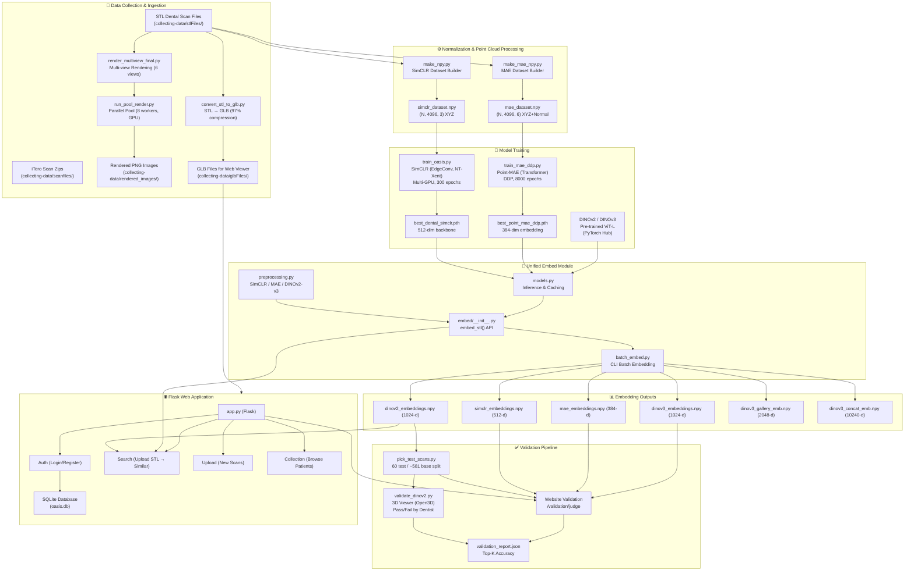
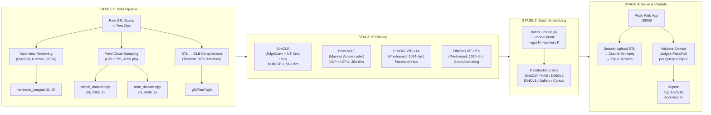
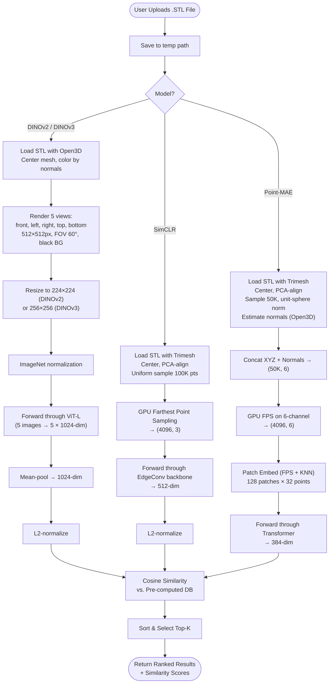
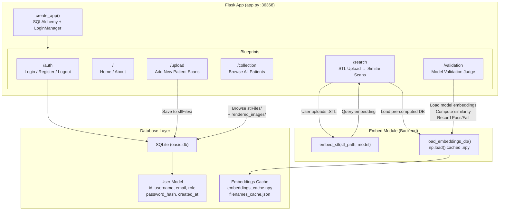
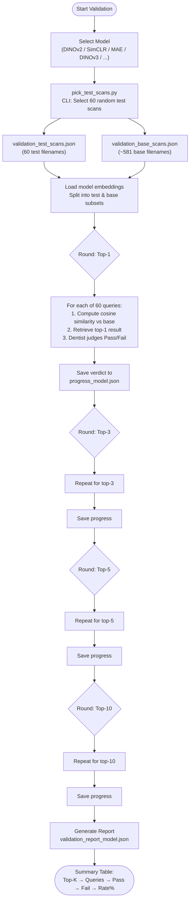

# OASIS — Project Architecture & Flowchart Report

> **OASIS**: Orthodontic AI Similarity Intelligence System  
> **Generated**: 2026-02-28  
> **Scope**: Full system analysis covering data pipelines, model training, embedding infrastructure, web application, and validation workflows.

---

## 1. Executive Summary

OASIS is an end-to-end dental scan similarity search system. It ingests 3D dental STL scans, processes them through multiple AI embedding models, and provides a web-based interface where dentists can upload a scan and find the most visually similar cases in the database using cosine similarity retrieval.

The system supports **6 embedding strategies** across two modalities:
- **3D Point Cloud models**: SimCLR (512-d), Point-MAE (384-d)
- **Multi-view Image models**: DINOv2 (1024-d), DINOv3 (1024-d), DINOv3 Gallery (2048-d), DINOv3 Concat (10240-d)

---

## 2. System Architecture Overview



---

## 3. End-to-End Pipeline Stages



---

## 4. Module Breakdown

### 4.1 Data Collection (`collecting-data/`)

| Component | File | Purpose |
|-----------|------|---------|
| Multi-view Renderer | `render_multiview_final.py` | Renders each STL from 6 viewpoints (front, back, top, bottom, left, right) at 512×512px using Open3D offscreen renderer with EGL |
| Parallel Runner | `run_pool_render.py` | Orchestrates rendering with 8 worker processes on a designated GPU |
| STL → GLB Converter | `tools/convert_stl_to_glb.py` | Simplifies meshes to 15% faces + gzip compresses for web viewing (97% size reduction) |

### 4.2 Normalization (`normalization/`)

| Component | File | Output | Pipeline |
|-----------|------|--------|----------|
| SimCLR Dataset | `make_npy.py` | `simclr_dataset.npy` (N, 4096, 3) | Load STL → Center → PCA-align → Uniform sample 100K → GPU FPS → 4096 XYZ points |
| MAE Dataset | `make_mae_npy.py` | `mae_dataset.npy` (N, 4096, 6) | Load STL → Center → PCA-align → Sample 50K → Unit-sphere normalize → Estimate normals → Concat XYZ+Normal → GPU FPS → 4096 points |

### 4.3 Training (`train/`)

| Model | File | Architecture | Embedding Dim | Training Strategy |
|-------|------|-------------|---------------|-------------------|
| **SimCLR** | `train_oasis.py` | EdgeConv (DGCNN) + Projection Head | 512 | NT-Xent contrastive loss, 3 GPUs, batch 36, 300 epochs |
| **Point-MAE** | `train_mae_ddp.py` | Patch Embed (FPS+KNN) + Transformer | 384 | Masked autoencoder (75% mask), DDP 4 GPUs, batch 64/GPU, 8000 epochs |
| **DINOv2** | Pre-trained | ViT-L/14 | 1024 | Facebook's self-supervised (PyTorch Hub) |
| **DINOv3** | Pre-trained | ViT-L/16 | 1024 | Gram Anchoring (local checkpoint) |

### 4.4 Unified Embed Module (`embed/`)

| Component | File | Role |
|-----------|------|------|
| Public API | `__init__.py` | `embed_stl(stl_path, model)` → `{"embedding", "filename", "model", "dim"}` |
| Configuration | `config.py` | Centralized paths, model settings, rendering parameters |
| Preprocessing | `preprocessing.py` | Model-specific data prep: SimCLR (point cloud), MAE (point cloud + normals), DINOv2/v3 (multi-view rendering) |
| Model Inference | `models.py` | Lazy-loaded model cache, inference functions for all 6 model variants |
| Batch CLI | `batch_embed.py` | CLI to embed all STL files: `python -m embed.batch_embed --model dinov3 --gpu 1 --workers 12` |

### 4.5 Web Application (`website/`)

| Blueprint | Route Prefix | Functionality |
|-----------|-------------|---------------|
| **Auth** | `/auth` | User registration, login, logout (Flask-Login + SQLAlchemy) |
| **Main** | `/` | Home page, about page |
| **Search** | `/search` | Upload STL → real-time DINOv2 embedding → cosine similarity search → top-K results |
| **Upload** | `/upload` | Upload new patient STL scans (auto-naming: `{patient_uid}_{serial}.stl`) |
| **Collection** | `/collection` | Browse all patients, view rendered images by patient UUID |
| **Validation** | `/validation` | Multi-model validation UI — dentist selects model, judges top-K results as Pass/Fail |

### 4.6 Validation (`validation/`)

| Component | File | Purpose |
|-----------|------|---------|
| Test Scan Picker | `pick_test_scans.py` | Interactive CLI to select 60 test scans from 641 eligible (rest become base) |
| Desktop Validator | `validate_dinov2.py` | Open3D 3D viewer — dentist presses P/F per query, resume-capable |
| Web Validator | `website/routes/validation.py` | Browser-based validation for all 6 models, with progress tracking |

---

## 5. Embedding & Search Pipeline Detail



---

## 6. Web Application Architecture



---

## 7. Validation Pipeline Flow



---

## 8. Key Data Flow Summary

| Stage | Input | Process | Output |
|-------|-------|---------|--------|
| **Ingest** | Raw `.stl` files | Download from iTero / manual upload | `collecting-data/stlFiles/` |
| **Render** | `.stl` mesh | Open3D offscreen, 6 views × 512px | `rendered_images/<UUID>/*.png` |
| **Compress** | `.stl` mesh | Trimesh simplify + gzip GLB | `glbFiles/<name>.glb` |
| **Normalize (SimCLR)** | `.stl` mesh | Center → PCA → Sample → FPS | `simclr_dataset.npy` (N, 4096, 3) |
| **Normalize (MAE)** | `.stl` mesh | Center → PCA → Sample → Normals → FPS | `mae_dataset.npy` (N, 4096, 6) |
| **Train SimCLR** | Point cloud dataset | EdgeConv + NT-Xent, multi-GPU | `best_dental_simclr.pth` |
| **Train MAE** | Point cloud + normals | Masked Autoencoder, DDP | `best_point_mae_ddp.pth` |
| **Batch Embed** | STL files + models | `embed_stl()` per file | `{model}_embeddings.npy` + `{model}_filenames.json` |
| **Search** | User upload `.stl` | Embed → cosine sim vs DB | Top-K ranked results |
| **Validate** | 60 test scans | Per-model top-K judgments | `validation_report_{model}.json` |

---

## 9. Technology Stack

| Layer | Technologies |
|-------|-------------|
| **3D Processing** | Open3D (rendering, normals), Trimesh (mesh I/O, simplification) |
| **Deep Learning** | PyTorch, DDP, Mixed Precision (AMP), CUDA |
| **Models** | DGCNN/EdgeConv (SimCLR), Transformer (Point-MAE), ViT-L (DINOv2/v3) |
| **Web Framework** | Flask, Flask-Login, Flask-SQLAlchemy |
| **Database** | SQLite |
| **Data Format** | NumPy `.npy` (embeddings), JSON (filenames, configs), STL/GLB (meshes) |
| **Parallelism** | Python multiprocessing (Pool, DDP), ProcessPoolExecutor |
| **GPU** | EGL offscreen rendering, CUDA inference, multi-GPU training |

---

## 10. Directory Structure Reference

```
ytp_oasis/
├── collecting-data/          # Stage 1: Raw data & rendering
│   ├── stlFiles/             #   Raw STL dental scans
│   ├── scanfiles/            #   iTero scan zip archives
│   ├── rendered_images/      #   Multi-view PNG renders per UUID
│   ├── glbFiles/             #   Compressed GLB for web viewer
│   ├── render_multiview_final.py
│   └── run_pool_render.py
│
├── normalization/            # Stage 1b: Point cloud datasets
│   ├── make_npy.py           #   Build SimCLR dataset
│   ├── make_mae_npy.py       #   Build MAE dataset
│   └── *.npy                 #   Output datasets
│
├── train/                    # Stage 2: Model training + embeddings
│   ├── train_oasis.py        #   SimCLR training script
│   ├── train_mae_ddp.py      #   Point-MAE DDP training
│   ├── simclr/               #   SimCLR checkpoint + embeddings
│   ├── mae/                  #   MAE checkpoint + embeddings
│   ├── dinov2/               #   DINOv2 embeddings
│   ├── dinov3/               #   DINOv3 model + embeddings
│   ├── dinov3_concat/        #   DINOv3 concat embeddings
│   └── dinov3_gallery/       #   DINOv3 gallery embeddings
│
├── embed/                    # Stage 3: Unified embedding module
│   ├── __init__.py           #   Public API: embed_stl()
│   ├── config.py             #   Paths & constants
│   ├── preprocessing.py      #   Per-model preprocessing
│   ├── models.py             #   Model loading & inference
│   └── batch_embed.py        #   CLI batch embedding tool
│
├── validation/               # Stage 4a: Validation pipeline
│   ├── pick_test_scans.py    #   60/581 test/base split
│   ├── validate_dinov2.py    #   Desktop 3D validation
│   ├── progress/             #   Per-model progress JSONs
│   └── reports/              #   Per-model report JSONs
│
├── website/                  # Stage 4b: Web application
│   ├── app.py                #   Flask factory
│   ├── config.py             #   App configuration
│   ├── extensions.py         #   SQLAlchemy + LoginManager
│   ├── models/               #   User model (SQLAlchemy)
│   ├── routes/               #   6 blueprints (auth, main, search, upload, collection, validation)
│   ├── templates/            #   Jinja2 HTML templates
│   ├── static/               #   CSS, JS, uploads
│   └── database/             #   SQLite DB + embedding cache
│
└── tools/                    # Utilities
    ├── convert_stl_to_glb.py #   Batch STL→GLB converter
    └── view_stl.py           #   STL previewer
```

---

*Report generated from full codebase analysis of the OASIS project.*
